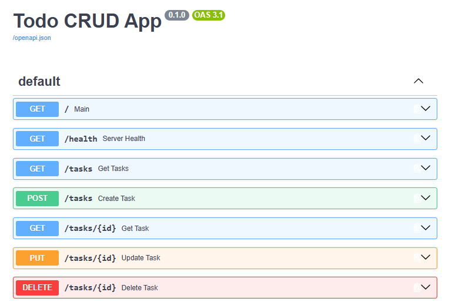

# Todo CRUD API

A small FastAPI application for managing an in-memory list of tasks. It supports
creating, reading, updating, and deleting tasks. Data resets whenever the server
restarts because no persistent database is configured.

## Install and Run

Install [uv](https://docs.astral.sh/uv/) and Python 3.14 or newer, then run this
single command from the project directory:

```bash
uv run fastapi dev main.py
```

The API is available at `http://localhost:8000`.

## Endpoints

| Method   | Path          | Description                                                 | Success response |
| -------- | ------------- | ----------------------------------------------------------- | ---------------- |
| `GET`    | `/`           | Returns the API name, version, and top-level endpoint link. | `200 OK`         |
| `GET`    | `/health`     | Checks whether the server is running.                       | `200 OK`         |
| `GET`    | `/tasks`      | Returns all tasks.                                          | `200 OK`         |
| `GET`    | `/tasks/{id}` | Returns one task by integer ID.                             | `200 OK`         |
| `POST`   | `/tasks`      | Creates a task with a required, non-empty `title`.          | `201 Created`    |
| `PUT`    | `/tasks/{id}` | Updates `title`, `done`, or both fields.                    | `200 OK`         |
| `DELETE` | `/tasks/{id}` | Deletes one task by integer ID.                             | `204 No Content` |

For missing tasks, the API returns `404 Not Found`. Invalid request bodies and
path parameters return `400 Bad Request`.

### Request examples

Create a task:

```json
{ "title": "Read the FastAPI docs" }
```

Update a task:

```json
{ "done": true }
```

## Example `curl -i` Output

With the server running, request the health endpoint:

```bash
curl -i http://localhost:8000/health
```

```http
HTTP/1.1 200 OK
date: Tue, 08 Sep 2026 00:00:00 GMT
server: uvicorn
content-length: 15
content-type: application/json

{"status":"ok"}
```

## Swagger UI Screenshot



The interactive Swagger UI is available at `http://localhost:8000/docs`.
