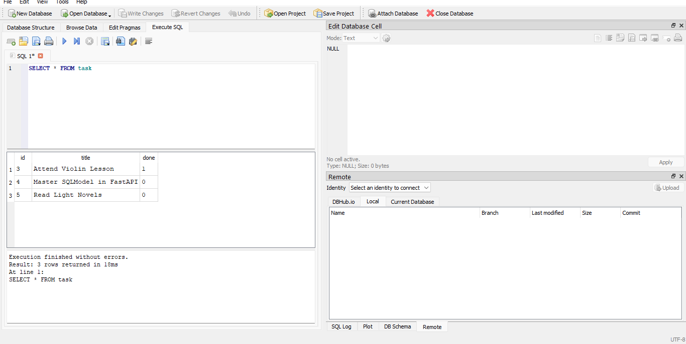
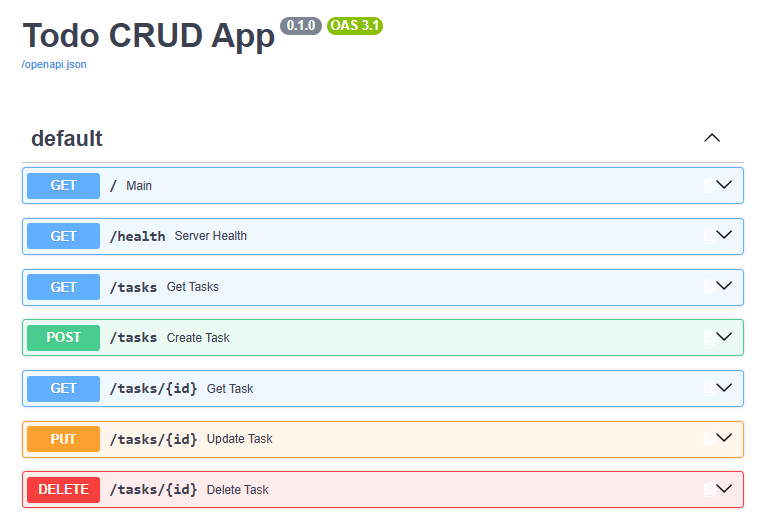

# Todo CRUD API

A small FastAPI application for creating, reading, updating, and deleting tasks.
Tasks are stored in a local SQLite database.

## Database

SQLite was chosen because it is lightweight, file-based, and does not require a
separate database server. That keeps this small CRUD project easy to run while
still providing persistent SQL storage.

The database file is `database.db` in the project root. The path is relative to
the working directory, so start the app from the project directory. On startup,
`main.py` calls `create_db_and_tables()`; SQLModel creates the database file and
the `task` table automatically if they do not already exist.

Example query for viewing saved tasks:

```sql
SELECT id, title, done FROM task;
```

To inspect the database, open `database.db` in a SQLite viewer such as DB Browser
for SQLite. A database-viewer screenshot has not been added yet; save it as
`docs/database-viewer.png` and embed it here:



## Install and Run

Install [uv](https://docs.astral.sh/uv/) and Python 3.14 or newer. From the
project directory, run:

```bash
uv run fastapi dev main.py
```

`uv` installs the project dependencies from `pyproject.toml` as needed. On the
first startup, the app creates `database.db` and its tables automatically. The
API is available at `http://localhost:8000`, and Swagger UI is at
`http://localhost:8000/docs`.

## Endpoints

| Method   | Path             | Description                              | Success response |
| -------- | ---------------- | ---------------------------------------- | ---------------- |
| `GET`    | `/v1/tasks/`     | Returns all tasks.                       | `200 OK`         |
| `GET`    | `/v1/tasks/{id}` | Returns one task by integer ID.          | `200 OK`         |
| `POST`   | `/v1/tasks/`     | Creates a task with a required `title`.  | `201 Created`    |
| `PUT`    | `/v1/tasks/{id}` | Updates `title`, `done`, or both fields. | `200 OK`         |
| `DELETE` | `/v1/tasks/{id}` | Deletes one task by integer ID.          | `204 No Content` |

For missing tasks, the API returns `404 Not Found`. Invalid request bodies and
path parameters return `400 Bad Request`.

### Request examples

Create a task:

```json
{ "title": "Read the FastAPI docs" }
```

Update a task:

```json
{ "done": true }
```

## Swagger UI Screenshot



The interactive Swagger UI is available at `http://localhost:8000/docs`.
